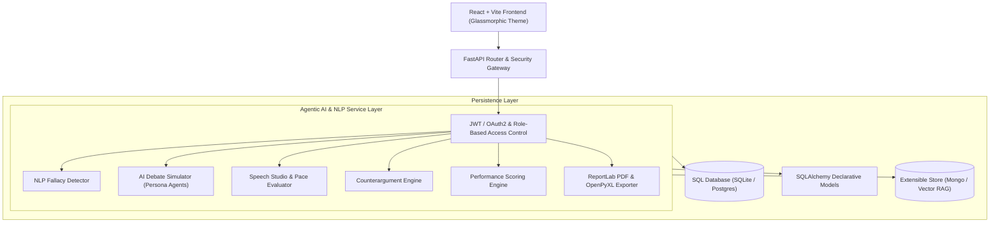

# Master Architecture Specification v1.0
## Agentic AI Debate Coach & Presentation Analysis Platform

**Version:** 1.0 (LOCKED)  
**Status:** Final Specification  

---

## 1. Overall Project Vision

The **Agentic AI Debate Coach & Presentation Analysis Platform** is an enterprise-grade AI-powered web solution designed to help users evaluate, practice, and elevate their argumentation, presentation, logic, and public speaking skills.

Unlike basic single-prompt chatbots, the platform functions as an **Agentic AI Ecosystem** comprising specialized engines for:
* **Argument Analysis & Structuring**
* **NLP Logical Fallacy Detection**
* **Counterargument & Rebuttal Generation**
* **AI Debate Persona Simulation** (*Socrates*, *The Pragmatist*, *The Aggressor*)
* **Live Speech Studio & WPM/Filler Tracking**
* **Multi-dimensional Performance Scoring & Radar Analytics**
* **PDF & Excel Report Exports**

The platform natively supports **four distinct user roles**:
1. **Learner**: Practice speeches, participate in AI debates, view personal radar analytics, and download session reports.
2. **Debate Coach**: Review learner session records, leave qualitative feedback, assign practice topics, and track learner progress.
3. **Educator**: Manage student classes, assign debate topics, monitor cohort-wide performance, and view aggregate fallacy statistics.
4. **Administrator**: Oversee global system usage, user management, API metrics, and system-wide configurations.

---

## 2. High-Level System Architecture



---

## 3. Core AI Philosophy & Modular Architecture

The core philosophy of the platform enforces **Modular Separation of Concerns**:

1. **Not Just a Chatbot**: AI capabilities are decoupled into dedicated Python services (`fallacy.py`, `debate_ai.py`, `speech.py`, `scoring.py`, `chat_service.py`, `counterargument.py`, `reports.py`).
2. **Real-time Feedback**: Browser-native Web Speech API (`SpeechRecognition`) and Web Audio API (`AudioContext` FFT frequency analysis) provide instant audio visuals without high server streaming overhead.
3. **Transparent Evaluation**: Scoring is deterministic across 3 key axes:
   - **Communication Score** (Pace WPM, Filler Ratio, Clarity)
   - **Logic Score** (Fallacy Density, Premise Strength, Rebuttal Relevance)
   - **Delivery Score** (Confidence, Time Utilization, Engagement)

---

## 4. Repository Structure & Layering

```
/ (workspace root)
├── backend/
│   ├── app/
│   │   ├── core/           # Security, JWT tokens, RBAC config
│   │   ├── database/       # DB connection (SQLite / Postgres)
│   │   ├── models/         # SQLAlchemy DB models (User, Profile, DebateSession, etc.)
│   │   ├── schemas/        # Pydantic validation DTOs
│   │   ├── routers/        # FastAPI API controllers (auth, debate, speech, coaching, admin)
│   │   ├── services/       # NLP Fallacy engine, AI Debate simulator, Speech evaluator, Exports
│   │   └── main.py         # Application entry point
│   ├── requirements.txt    # Python dependencies (FastAPI, ReportLab, OpenPyXL, Pandas)
│   └── Dockerfile
├── frontend/
│   ├── src/
│   │   ├── components/     # Waveforms, Fallacy badges, Radar plots, Navbars, Modals
│   │   ├── contexts/       # AuthContext, DebateContext
│   │   ├── pages/          # Dashboard, SpeechStudio, DebateRoom, ProfileSettings, AdminPanel
│   │   └── index.css       # Dark-mode glassmorphic theme & typography
│   ├── package.json        # Frontend Vite + React setup
│   └── Dockerfile
├── diagrams/               # Architecture & Workflow diagrams
└── docs/                   # Architectural & System documentation
```

---

## 5. Security & Data Integrity

* **Authentication**: Stateless JWT token authentication with configurable expiration.
* **Password Security**: Passwords hashed using Bcrypt with automatic salting.
* **RBAC Enforcement**: API routes protected via FastAPI dependencies (`get_current_user`, `require_role`).
* **Input Validation**: All requests validated through strict Pydantic schemas.
