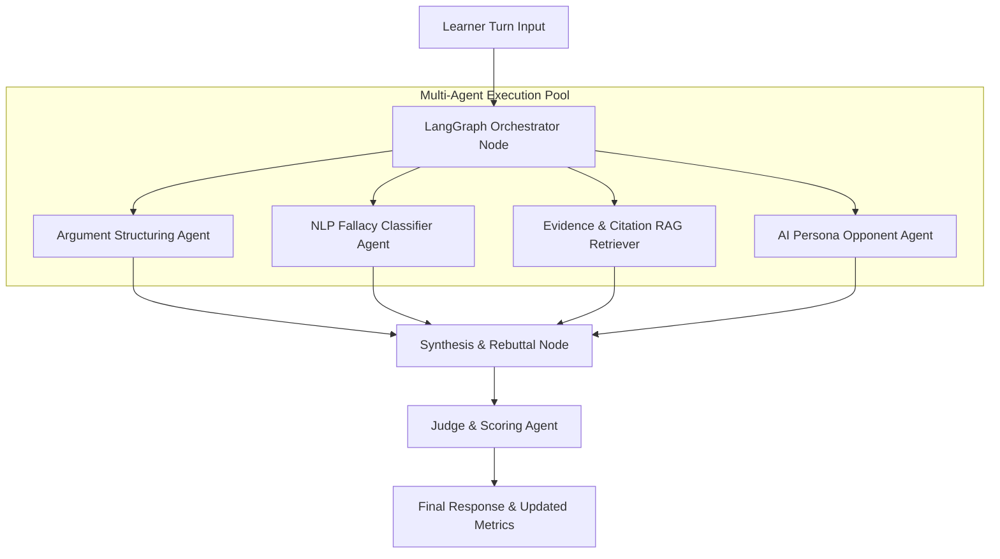

# Milestone 4 Advanced Roadmap & Documentation
## Agentic AI Debate Coach & Presentation Analysis Platform

---

## 1. Scope & Extension Plan

Milestone 4 introduces advanced enterprise features, multi-tenant class management, multi-agent LangGraph orchestrations, and RAG vector store evidence integration.

---

## 2. Advanced Multi-Agent LangGraph Architecture

---

## 3. Enterprise Analytics & Class Management

### 3.1 Educator Cohort Tracking
- **Multi-Tenant Class Rooms**: Educators can create class cohorts, assign practice topics, and enforce submission deadlines.
- **Fallacy Frequency Matrices**: View aggregated fallacy occurrences across all students to tailor classroom curriculum.

### 3.2 RAG Vector Knowledge Base
- **FAISS / Vector Index**: Store debate topic evidence documents and research citations.
- **Fact-Checking Engine**: Validate factual assertions made during debates against retrieved vector embeddings.

---

## 4. Multi-Format Report Automation

- **Automated Email Exports**: Schedule weekly PDF performance digests delivered to learners and coaches.
- **OpenPyXL Workbooks**: Generate multi-tab Excel workbooks containing turn-by-turn timestamps, WPM pace metrics, filler word counts, and fallacy logs.
