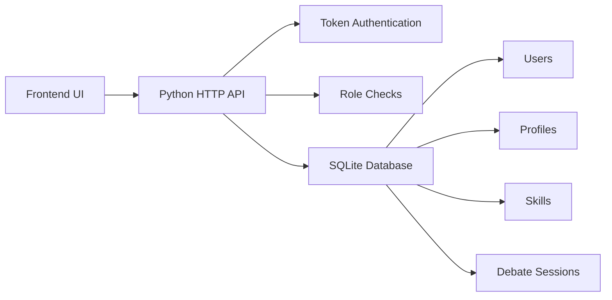

# System Architecture

## Milestone 1 Architecture

## Backend

- `backend/server.py` exposes JSON API routes and serves the frontend.
- `backend/database.py` owns database creation, seed data, and persistence helpers.
- `backend/auth.py` handles password hashing, token creation, and token validation.

## Frontend

- `frontend/index.html` provides the app shell.
- `frontend/styles.css` defines the interface.
- `frontend/app.js` handles authentication, API calls, dashboard rendering, profiles, skill tracking, and debate sessions.

## Later Milestone Upgrade Path

- Replace the dependency-light Python server with FastAPI.
- Replace SQLite with PostgreSQL.
- Add LLM-powered argument analysis, fallacy detection, debate simulation, presentation analytics, and reports.
- Add Docker, automated tests, and cloud deployment.

