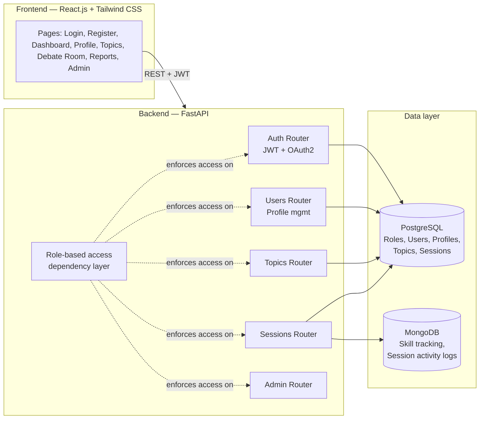

# System Architecture

## Overview

## Why this split

- **PostgreSQL (primary / relational):** Roles, Users, Profiles, Topics, and Sessions are strongly
  structured, relational, and benefit from foreign keys and transactional integrity — a learner
  belongs to exactly one role, a session belongs to exactly one user and one topic.
- **MongoDB (secondary / flexible):** Skill tracking and session activity logs are append-only,
  evolving, and will grow richer once AI modules (fallacy detection, speech analysis) start writing
  structured-but-varied output. A document store avoids repeated schema migrations as those AI
  outputs change shape across milestones.

## Authentication & authorization flow

1. Passwords are hashed with **bcrypt** (via passlib) before storage — never stored in plaintext.
2. On login, the API issues a short-lived **access token** (60 min default) and a longer-lived
   **refresh token** (7 days default), both JWTs signed with `SECRET_KEY`.
3. The access token carries `sub` (user id) and `role` claims.
4. Every protected route depends on `get_current_active_user`, which decodes the token and loads
   the user from PostgreSQL.
5. Routes restricted to specific roles add `RoleChecker([...])` as an additional dependency.
6. The frontend axios client automatically retries a request once with a refreshed token on a 401,
   then redirects to `/login` if the refresh also fails.
7. Google OAuth2 is scaffolded (`/api/v1/auth/google/login`, `/callback`) and will be completed
   once client credentials are supplied — it is optional per the milestone brief.

## Environment-based configuration

All secrets and connection strings (`SECRET_KEY`, database URIs, OAuth credentials) are read from
environment variables via `pydantic-settings`, never hardcoded — see `backend/.env.example`.

## Scalability notes for future milestones

- Table/collection design already anticipates AI modules: `DebateSession` has `coach_id` for
  human-in-the-loop review, and the Mongo `session_logs`/`skill_tracking` collections are ready to
  receive structured AI output (argument scores, fallacy tags, delivery metrics) without schema
  changes to the relational core.
- FastAPI routers are modular (`auth`, `users`, `topics`, `sessions`, `admin`) so new routers
  (`chatbot`, `analysis`, `recommendations`) can be added independently in later milestones.
- `Base.metadata.create_all()` is used for Milestone 1 simplicity; Alembic is already a listed
  dependency and should be adopted for versioned migrations before production use.
