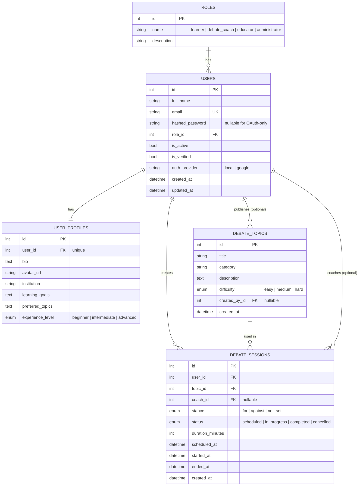

# Database Design

## PostgreSQL — relational core



## MongoDB — flexible / append-only data

Used for data that is naturally document-shaped, high-write, or expected to evolve in structure
once AI modules land in later milestones.

### `skill_tracking`
Reserved for per-learner skill metrics (argument strength trend, fallacy frequency, delivery
scores). Structure only in Milestone 1 — no AI writes yet.

```json
{
  "user_id": 12,
  "skill": "rebuttal_speed",
  "history": [
    { "session_id": 42, "score": null, "recorded_at": "2026-07-10T10:00:00Z" }
  ]
}
```

### `session_logs`
Append-only activity log per debate session — already wired to receive writes in Milestone 1
(session created, status transitions), ready for AI event types like `fallacy_detected` later.

```json
{
  "session_id": 42,
  "user_id": 12,
  "event": "status_changed_to_in_progress",
  "timestamp": "2026-07-10T10:05:00Z"
}
```

## Why two databases

| Concern | Store | Reason |
|---|---|---|
| Identity, roles, relationships | PostgreSQL | Strong consistency, foreign keys, transactions |
| Structured profile & session state | PostgreSQL | Predictable schema, needs joins/filters |
| Skill metrics & activity logs | MongoDB | High write volume, schema will evolve as AI features are added, no need for joins |
