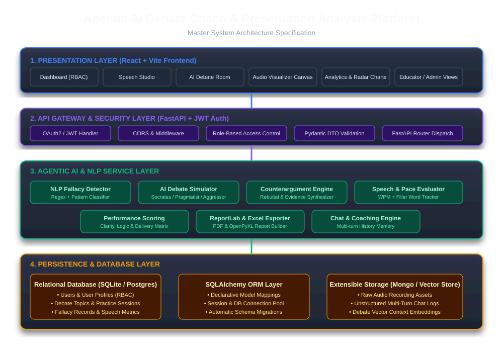

# System Architecture Specification
## Agentic AI Debate Coach & Presentation Analysis Platform

---

## 1. Architecture Overview

The platform is structured into a 5-tier modular architecture designed for maximum performance, maintainability, and enterprise scalability:

1. **Presentation Layer**: React + Vite SPA rendered in client browser with dark-mode glassmorphism styling.
2. **API Gateway & Router Layer**: FastAPI endpoint controllers, CORS middleware, and input/output schema validation.
3. **Authentication & Authorization Layer**: JWT token validation and Role-Based Access Control (Learner, Coach, Educator, Admin).
4. **Agentic AI & NLP Service Layer**: Specialized NLP fallacy detection engine, AI debate persona agents, speech pace tracker, scoring engine, and PDF/Excel report generator.
5. **Persistence & Database Layer**: SQLAlchemy ORM connected to SQLite (default) / PostgreSQL, with MongoDB / Vector Store capability for multi-turn history.

---

## 2. Master System Architecture Diagram

---

## 3. Tier Breakdown & Layer Responsibilities

### 3.1 Presentation Layer (Frontend)
- **Framework**: React 18 + Vite
- **Styling**: Custom Vanilla CSS with CSS Custom Properties (`--bg-primary`, `--accent-blue`, `--glass-bg`)
- **Key Modules**:
  - `Dashboard.jsx`: Unified role-based dashboard with radar growth charts and recent activity logs.
  - `SpeechStudio.jsx`: Real-time microphone audio recording with HTML5 Canvas FFT visualizer and WPM meter.
  - `DebateRoom.jsx`: Multi-turn debate interface with automated timers, persona selector, and fallacy flag feed.
  - `ProfileSettings.jsx`: User preference management, target domains, and experience level setup.

### 3.2 API Gateway Layer (FastAPI)
- **Framework**: Python FastAPI running on Uvicorn
- **Responsibilities**:
  - Expose REST API routes under `/api/v1`
  - Enforce CORS policies for frontend interaction
  - Automatic OpenAPI / Swagger interactive documentation generation (`/docs`)
  - Request body parsing and validation via Pydantic (`schemas.py`)

### 3.3 Security & Auth Layer
- **Token Mechanism**: JSON Web Tokens (JWT) signed with HS256 algorithm
- **Password Protection**: Passlib + Bcrypt hashing
- **Role Control**: FastAPI dependency injection enforcing route access by user role (`LEARNER`, `COACH`, `EDUCATOR`, `ADMIN`)

### 3.4 Agentic AI & NLP Services
- `fallacy.py`: Regex pattern matching and keyword classifiers to detect logical fallacies (*Ad Hominem*, *Straw Man*, *False Dilemma*, *Slippery Slope*, *Appeal to Authority*).
- `debate_ai.py`: Multi-persona debate simulation engine providing tailored counterarguments.
- `speech.py`: Transcribes audio, measures WPM pace, identifies filler words ("um", "like", "you know"), and calculates delivery scores.
- `scoring.py`: Computes composite performance matrix across Logic, Communication, and Delivery.
- `reports.py`: Assembles PDF executive summaries using ReportLab and detailed data workbooks via OpenPyXL.

### 3.5 Persistence Layer
- **ORM**: SQLAlchemy Declarative Mapping
- **Database**: SQLite (`sql_app.db` / `debate_coach.db`) with zero-code migration path to PostgreSQL
- **Entities**: Users, UserProfiles, UserSkills, DebateTopics, DebateSessions, SessionRounds, FallacyRecords, SpeechRecords.
