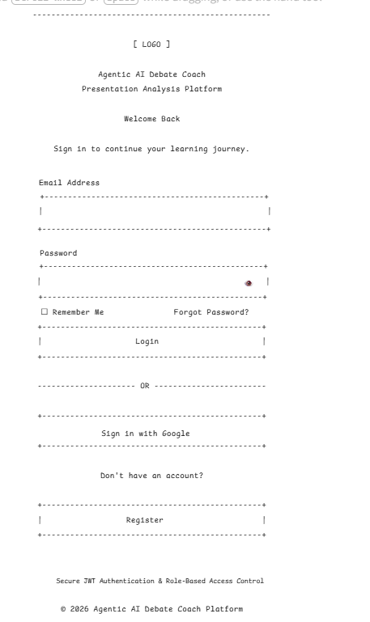
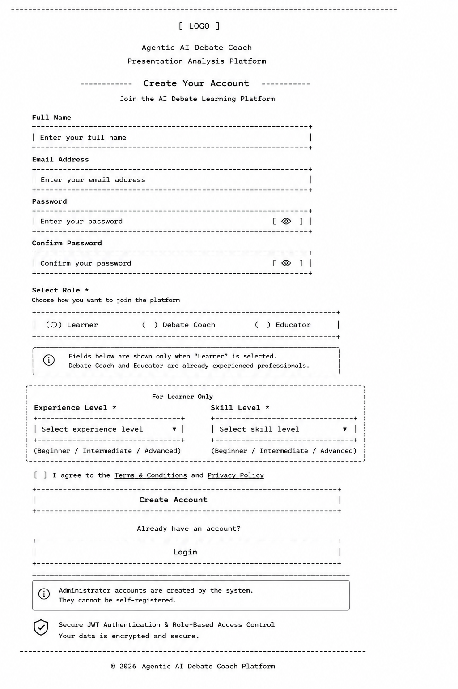
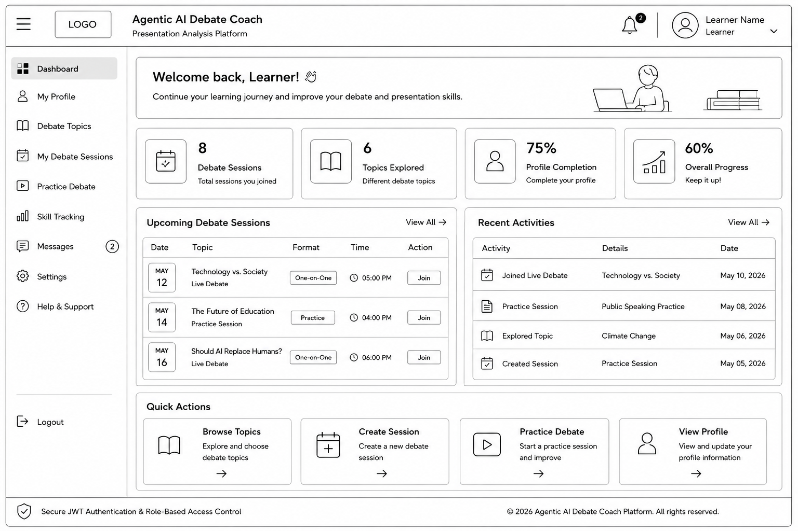
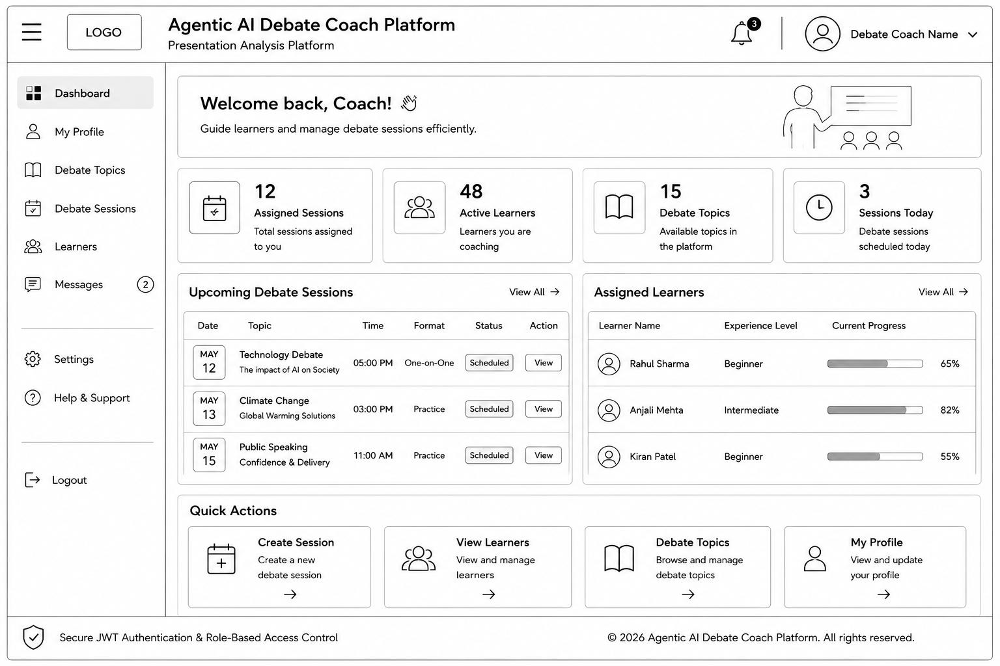
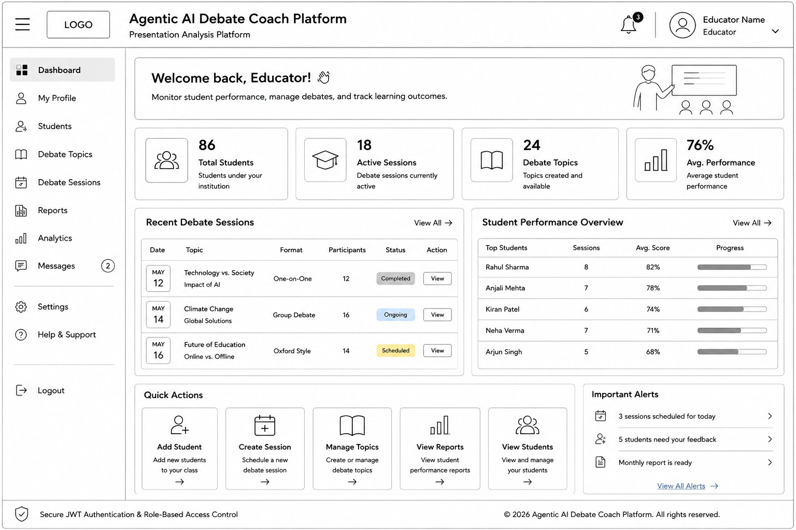
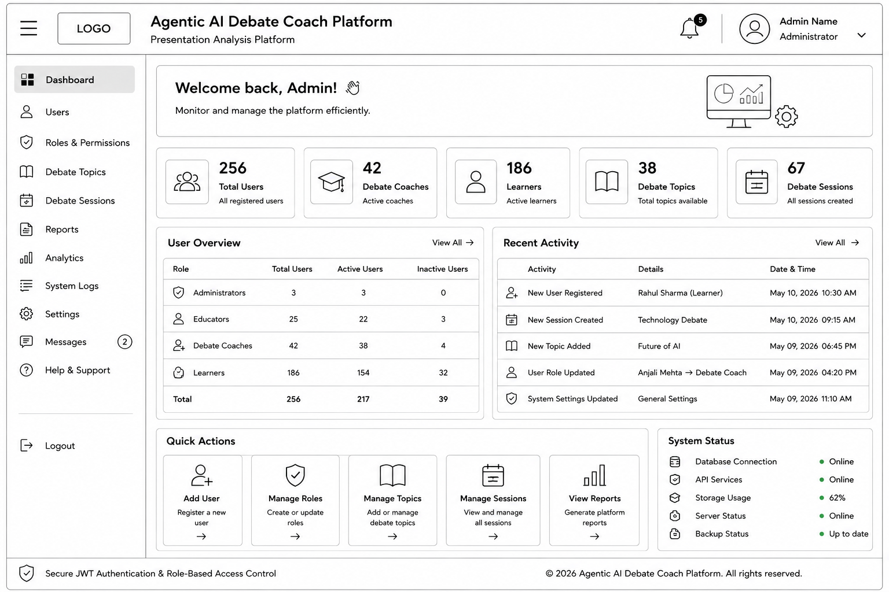
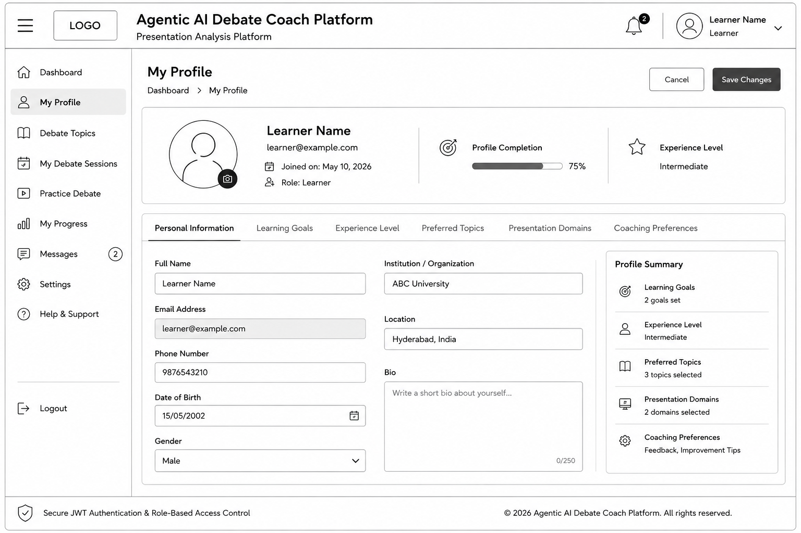
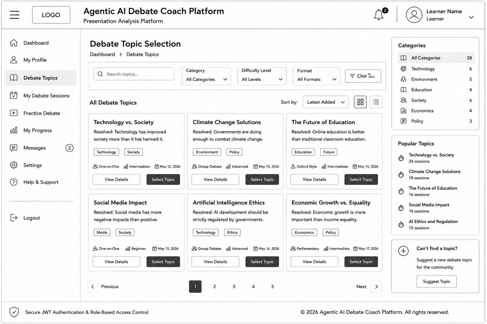
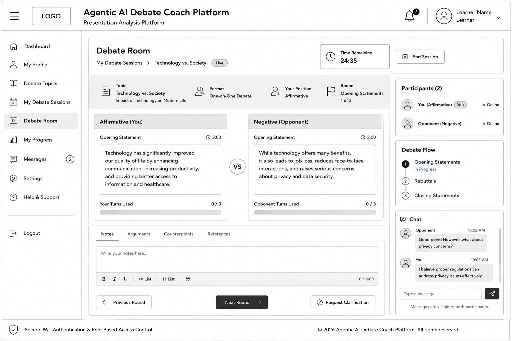
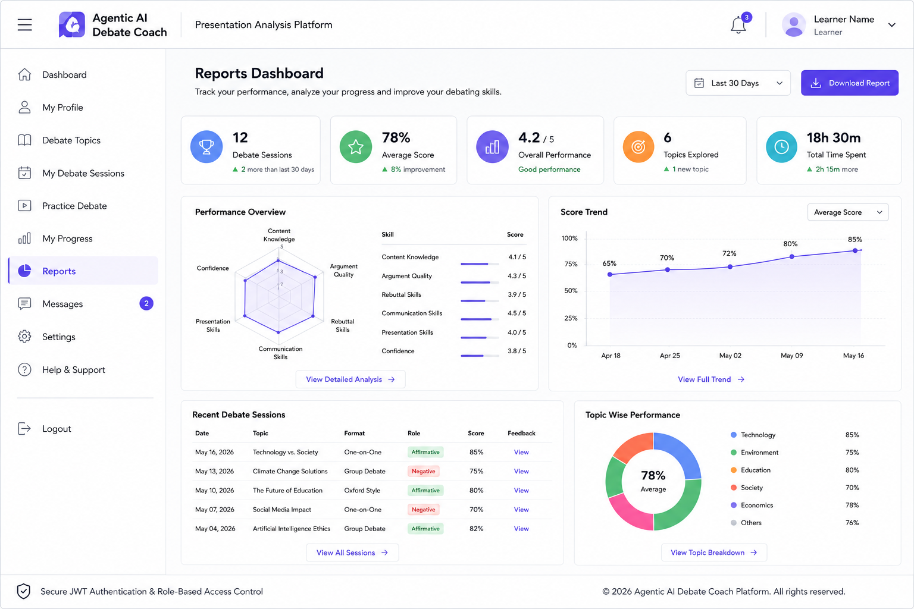

# UI Wireframes

## Responsive Design Note

The wireframes provided in this document represent the desktop/web layout of the application.

During frontend implementation using React.js, the application will follow a responsive design approach to support:

- Desktop
- Laptop
- Tablet
- Mobile

Responsive behavior will be implemented using modern CSS techniques and media queries while maintaining the same functionality across all devices.

## 1. Login Page

## 2. Registration Page

## 3. Learner Dashboard

## 4. Debate Coach Dashboard

## 5. Educator Dashboard

## 6. Admin Dashboard

## 7. User Profile

## 8. Debate Topic Selection

## 9. Debate Topic Selection

## 10. Reports Dashboard

