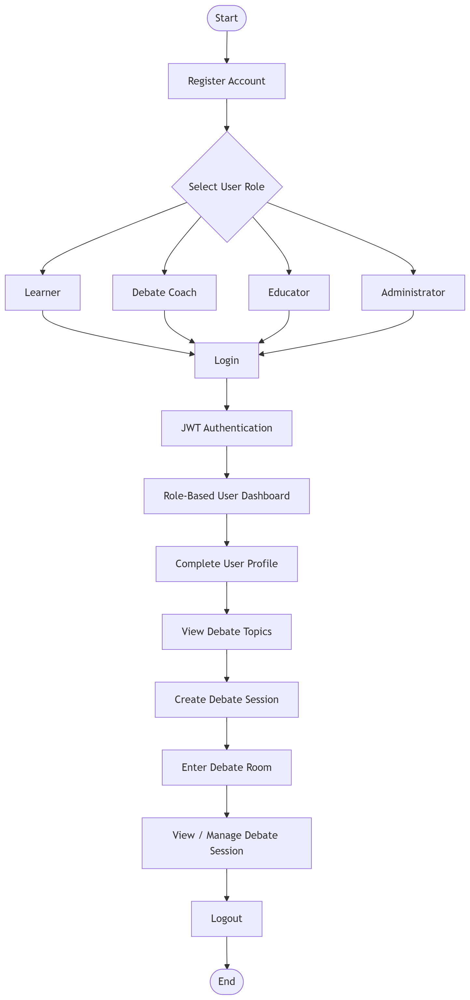
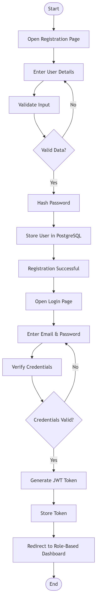
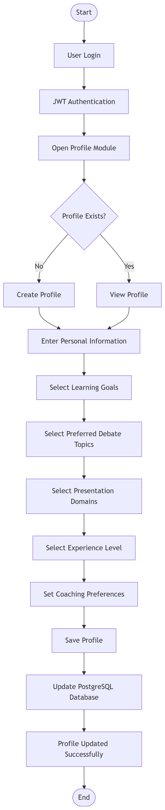
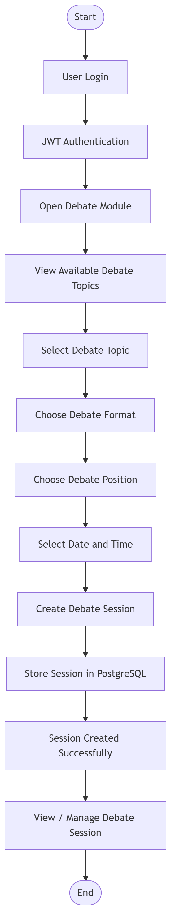
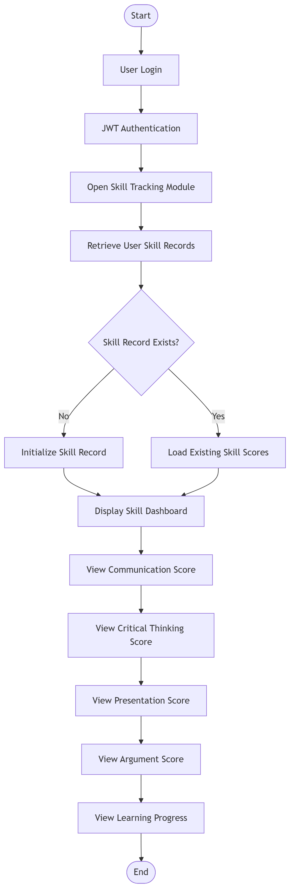

# Workflow Design

## Project Workflow

The Agentic AI Debate Coach & Presentation Analysis Platform follows a modular workflow where users register, authenticate, manage their profiles, participate in debate sessions, and later interact with AI-powered coaching modules.

Milestone 1 focuses only on the foundation workflow before AI modules are integrated.

---

## 1. Overall System Workflow

### Description

This workflow describes the complete journey of a user from registration to creating and managing a debate session.

---

# 2. Authentication Workflow

### Description

The authentication workflow handles user registration, input validation, password hashing, credential verification, JWT token generation, and redirects authenticated users to their role-based dashboard.

# 3. User Profile Workflow

### Description

The User Profile Workflow allows authenticated users to create or update their profile by providing personal information, learning goals, preferred debate topics, presentation domains, experience level, and coaching preferences. The profile information is stored in the PostgreSQL database and can be updated whenever required.

---

# 4. Debate Session Workflow

### Description

The Debate Session Workflow allows authenticated users to create and manage debate sessions. Users can browse available debate topics, select a topic, choose the debate format, select their debate position, schedule the session, and save it to the PostgreSQL database. After creation, users can view and manage their debate sessions.
---

# 5. Skill Tracking Workflow

### Description

The Skill Tracking Workflow allows authenticated users to view their current skill records, including communication, critical thinking, presentation, and argument scores. During Milestone 1, the system retrieves and displays these scores from the PostgreSQL database.

Note:
Automatic AI-based score calculation will be implemented in future milestones.

---

# 6. Learner Workflow

New Learner
↓
Register
↓
Login
↓
Learner Dashboard
↓
Complete Profile
↓
Select Preferred Debate Topics
↓
Create Debate Session
↓
View Debate Sessions
↓
View Skill Tracking
↓
Logout

---

# 7. Debate Coach Workflow

New Debate Coach
↓
Register
↓
Login
↓
Coach Dashboard
↓
Complete Profile
↓
View Assigned Debate Sessions
↓
Monitor Learner Progress
↓
Manage Debate Sessions
↓
Logout

---

# 8. Educator Workflow

New Educator
↓
Register
↓
Login
↓
Educator Dashboard
↓
Complete Profile
↓
View Student Progress
↓
Monitor Debate Sessions
↓
View Reports
↓
Logout

---

# 9. Administrator Workflow

Administrator
↓
Login
↓
Admin Dashboard
↓
Manage Users
↓
Manage Roles
↓
Manage Debate Topics
↓
Monitor Platform
↓
Logout

---

# 10. Future AI Workflow (Not Part of Milestone 1)

Debate Session
↓
Argument Analysis
↓
Logical Fallacy Detection
↓
Counterargument Generation
↓
Presentation Analysis
↓
Performance Scoring
↓
Recommendation Engine
↓
Personalized Feedback

---

# Workflow Summary

Milestone 1 Workflow

Registration
↓
Authentication
↓
Role-Based Dashboard
↓
Profile Management
↓
Debate Topic Selection
↓
Debate Session Management

-----------------------------------------------
Future Milestones

Debate Session
↓
AI Analysis
↓
Performance Evaluation
↓
Recommendations