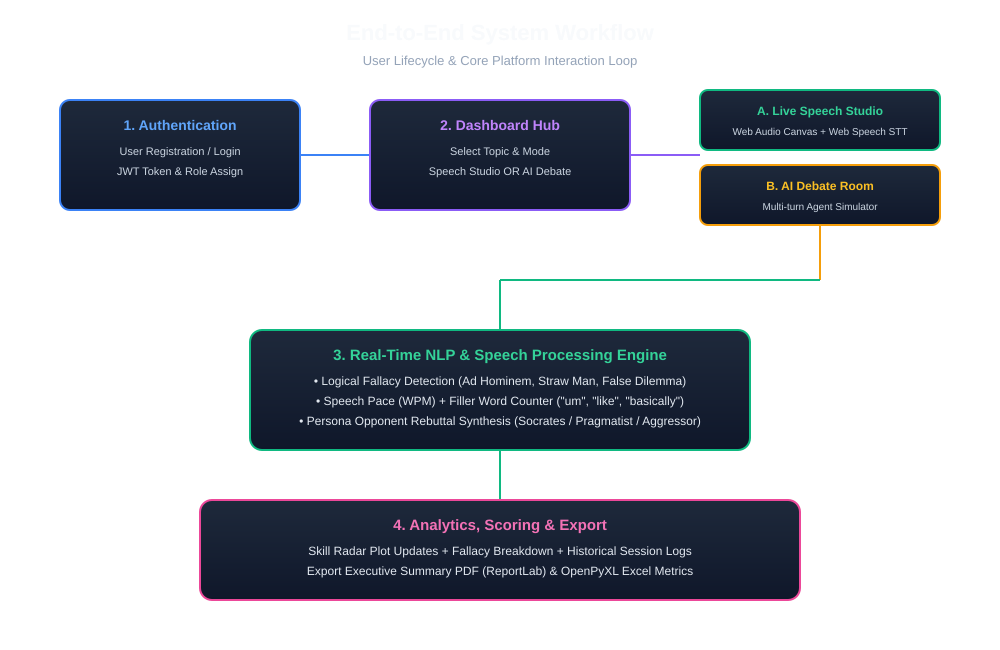
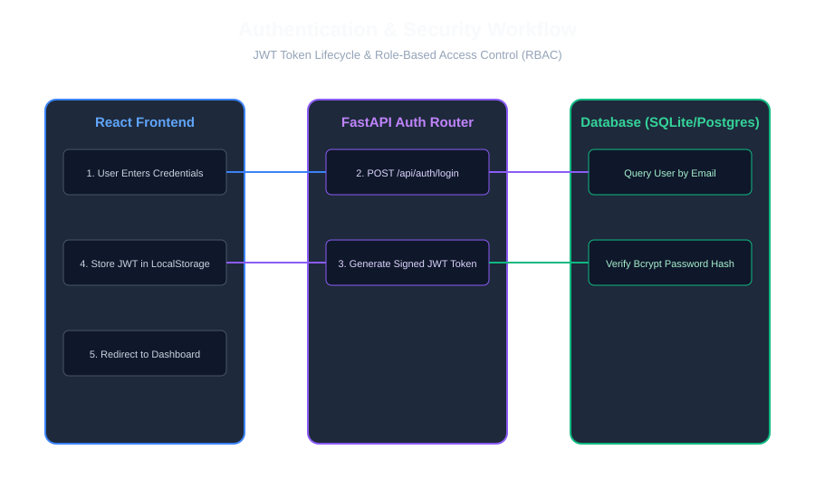
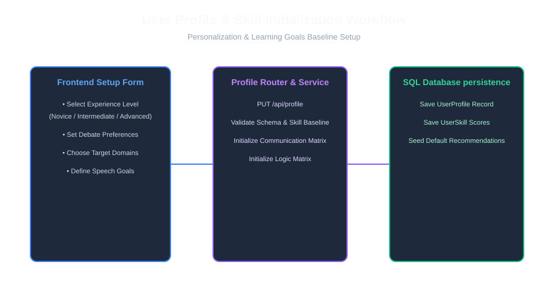
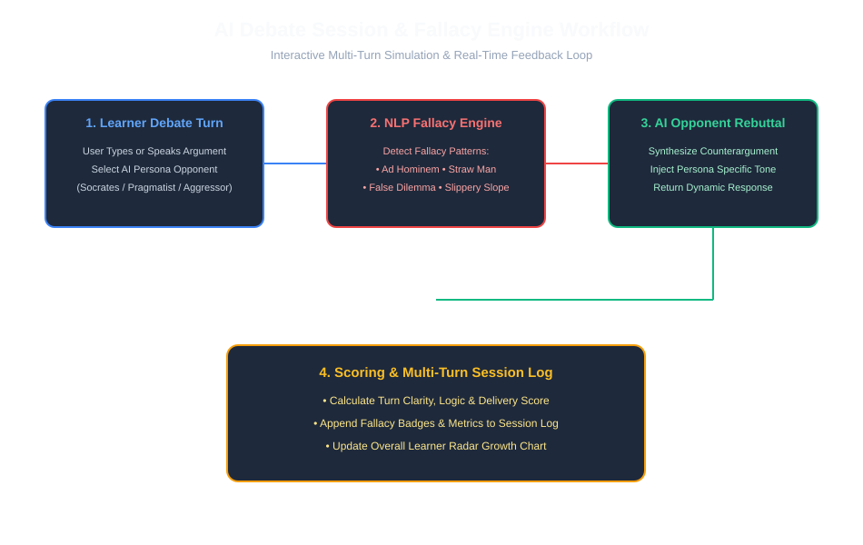
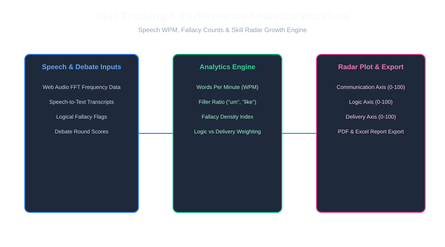

# System & User Workflows Specification
## Agentic AI Debate Coach & Presentation Analysis Platform

---

## 1. Executive Summary

This document describes the primary operational workflows of the platform, detailing user state transitions, frontend component interactions, backend service logic, and database persistence.

---

## 2. End-to-End System Workflow

### 2.1 Description
1. **Registration & Auth**: The user registers or logs into the platform, receiving a signed JWT token containing their user ID and role (`LEARNER`, `COACH`, `EDUCATOR`, `ADMIN`).
2. **Dashboard Dispatch**: The frontend redirects the user to their role-specific dashboard.
3. **Studio or Debate Mode Selection**:
   - **Speech Studio**: Practice unscripted or scripted public speaking with live audio frequency visualizations.
   - **AI Debate Room**: Engage in multi-turn debate simulations against AI opponents (*Socrates*, *The Pragmatist*, *The Aggressor*).
4. **NLP Processing & Scoring**: Speeches and debate turns are evaluated in real time for logical fallacies, WPM pace, and filler words.
5. **Analytics & Exports**: Radar metrics update instantly, and users can export comprehensive PDF / Excel performance reports.

---

## 3. Authentication & Authorization Workflow

### 3.1 Step-by-Step Flow
1. **User Action**: Enters credentials into `Login.jsx`.
2. **API Request**: Frontend invokes `POST /api/v1/auth/login`.
3. **DB Verification**: FastAPI queries SQLite/Postgres for user by email and validates the Bcrypt password hash using Passlib.
4. **Token Generation**: FastAPI creates an HS256 JWT access token encoding `{sub: user.id, role: user.role}`.
5. **Client Response**: Token saved in `localStorage`, and `AuthContext` updates user state.

---

## 4. User Profile & Baseline Workflow

### 4.1 Step-by-Step Flow
1. **Profile Setup**: User navigates to `ProfileSettings.jsx` and inputs experience level (*Novice*, *Intermediate*, *Advanced*), target presentation domains, and speech goals.
2. **Persistence**: Submitted data sent via `PUT /api/v1/profile/me`.
3. **Skill Baselining**: System seeds initial skill vector (`communication: 70`, `logic: 70`, `delivery: 70`) for progress tracking.

---

## 5. AI Debate Session & Fallacy Detection Workflow

### 5.1 Step-by-Step Flow
1. **Session Setup**: Learner selects debate topic and chooses AI persona (*Socrates* for probing questions, *The Pragmatist* for factual counterarguments, *The Aggressor* for high-pressure challenges).
2. **Turn Input**: Learner submits argument text or speech audio.
3. **NLP Fallacy Engine (`fallacy.py`)**: Checks transcript against pattern dictionary to flag logical fallacies (*Ad Hominem*, *Straw Man*, *False Dilemma*, *Slippery Slope*, *Appeal to Authority*).
4. **AI Rebuttal (`debate_ai.py`)**: Synthesizes a counterargument aligned with the selected persona.
5. **Scoring & Logging (`scoring.py`)**: Computes turn score, updates debate round history, and refreshes the learner's skill radar plot.

---

## 6. Skill Tracking & Analytics Workflow

### 6.1 Step-by-Step Flow
1. **Continuous Data Ingestion**: Collects WPM, filler word count, fallacy occurrences, and turn scores.
2. **Score Matrix Update**: Computes rolling weighted averages for Communication, Logic, and Delivery.
3. **Visual Visualization**: Renders updated radar chart in `Dashboard.jsx`.
4. **Report Generation (`reports.py`)**: Renders PDF executive summaries using ReportLab and Excel workbooks using OpenPyXL.
