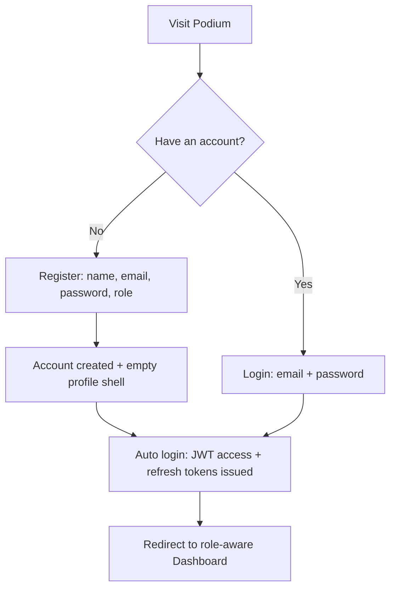
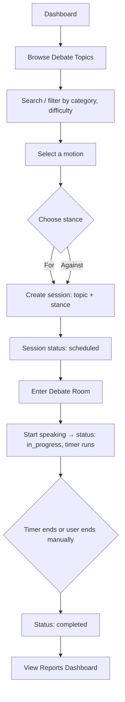
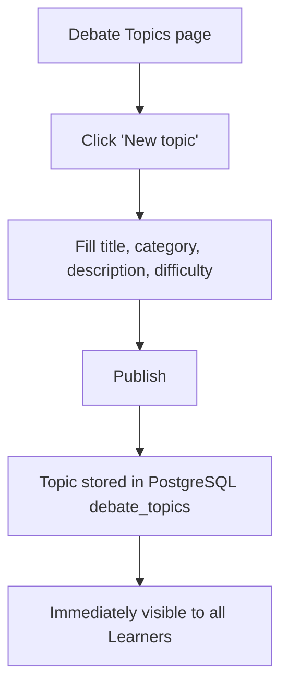
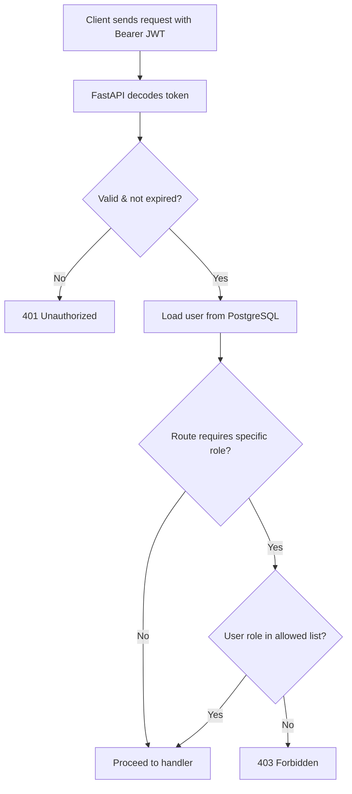
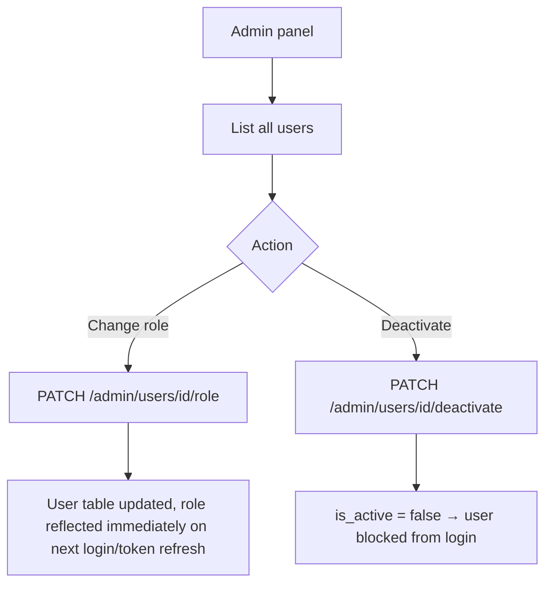

# Workflow Diagrams

## 1. Registration → Dashboard (all roles)

## 2. Starting a debate session (Learner)

## 3. Topic publishing (Debate Coach / Educator / Administrator)

## 4. Role-based access control (all requests)

## 5. Administrator user management

